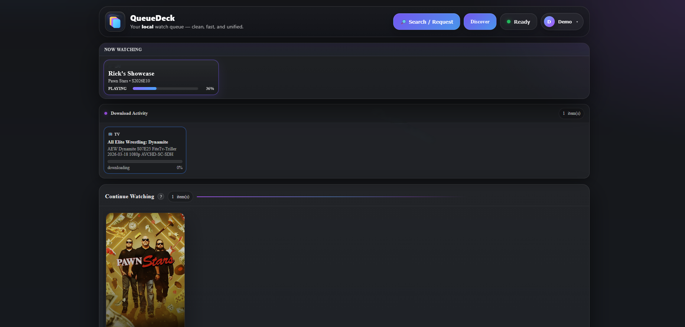
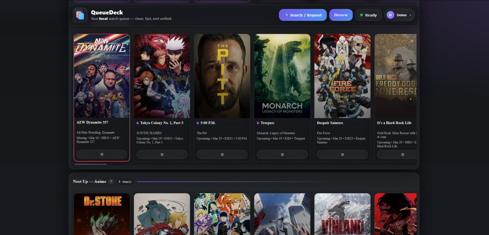
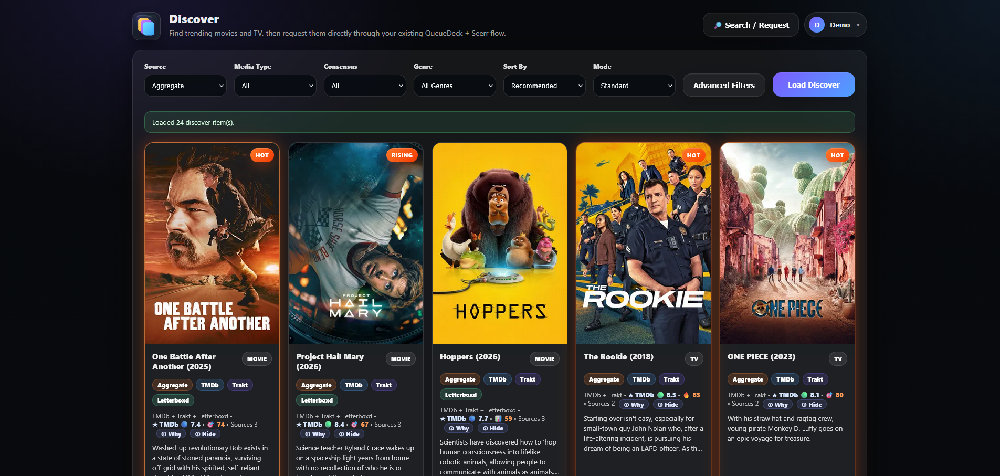
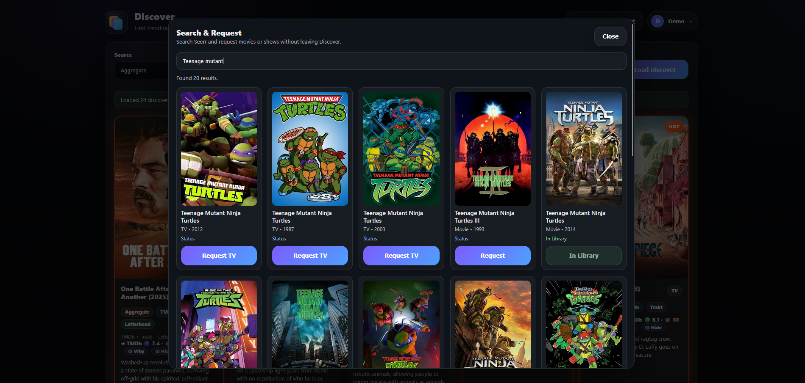
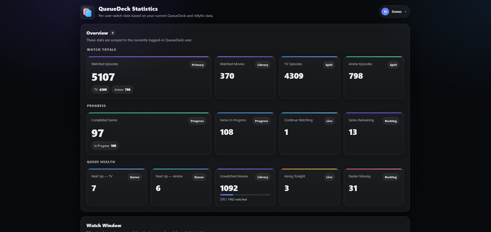
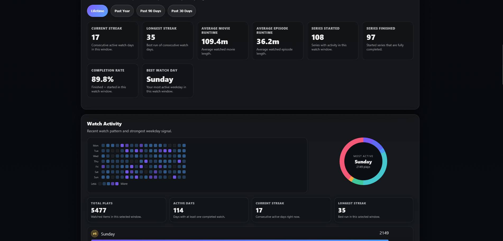

# 🎬 QueueDeck

> A fast, self-hosted media dashboard for tracking what to watch next — powered by Sonarr, Radarr, Jellyfin, and more.

QueueDeck brings all your media into one clean, modern interface so you can instantly see:

* 📺 What’s next to watch
* 🎞️ Recently added movies
* 📡 Upcoming episodes
* ❗ Missing content
* 🔥 Discover new shows and movies

Built for homelab users who want something **faster, cleaner, and more customizable** than traditional dashboards.

---

# 🤖 AI Usage

QueueDeck was developed with the assistance of AI tools to accelerate development, improve code quality, and iterate quickly on features.

All logic, integrations, and architecture have been reviewed and tested in real-world homelab environments.

---

# ✨ Features

* 🎯 **Unified Dashboard**
  * Continue Watching
  * Next Up (Sonarr)
  * Recently Added (Radarr)
  * Upcoming Episodes
  * Missing Content
  * Download Activity (qBittorrent)

* 🔍 **Discover Page**
  * Trending movies & TV
  * Anime integration
  * External metadata enrichment (TMDB)
  * Direct request flow

* 🔎 **Search & Request**
  * Integrated Seerr search
  * Request movies & shows without leaving QueueDeck
  * Library-aware (shows “In Library”)

* 📊 **Per-User Statistics**
  * Watch history & streaks
  * Completion rates
  * Activity heatmaps
  * Queue health metrics

* 📡 **RSS Feeds (Unique Feature)**
  * Export your queues as RSS feeds
  * Use with external dashboards (Homepage, Homarr, etc.)
  * Turn QueueDeck into a **data source**, not just a UI

* 🧠 **Smart UI**
  * Fast, minimal, modern design
  * Card-based layout
  * Smooth hover + interaction states

* 🔐 **Authentication System**
  * Secure login system
  * Admin panel
  * Login audit tracking
  * Session protection

* ⚙️ **Settings & Customization**
  * Per-user limits
  * Section visibility toggles
  * Integration configuration

* 🐳 **Docker-First**
  * Simple deployment
  * Lightweight image
  * Works great behind reverse proxies

---

# 📸 Screenshots

## Dashboard


## Dashboard


## Discover


## Search & Request


## Statistics


## Statistics More


---

# ⚠️ Seerr Integration Notes

> [!WARNING]
> QueueDeck uses the Seerr API for search and request functionality.  
> Due to Seerr API limitations, requests submitted via QueueDeck may bypass the normal Seerr approval workflow depending on your configuration.

**What this means:**
- Requests may be auto-approved
- Behavior depends on your Seerr permissions + API key setup

👉 Recommendation:
- Use a trusted Seerr user/API key
- Test behavior before exposing QueueDeck to other users

---

# 🔒 Security

QueueDeck is designed to be safely exposed behind a reverse proxy.

* ✅ Gunicorn production server
* ✅ Secure session cookies
* ✅ Login rate limiting (anti brute-force)
* ✅ Admin route protection
* ✅ SSRF protection (Letterboxd RSS)
* ✅ No secrets stored in repo

> ⚠️ Strongly recommended: run behind a reverse proxy (Caddy / Nginx / Traefik)

---

# 🌐 Reverse Proxy Example (Caddy)

```caddy
queuedeck.example.com {
    reverse_proxy 192.168.1.52:7071

    encode gzip zstd

    header {
        Strict-Transport-Security "max-age=31536000; includeSubDomains; preload"
        X-Frame-Options "DENY"
        X-Content-Type-Options "nosniff"
        Referrer-Policy "strict-origin-when-cross-origin"
        Content-Security-Policy "default-src 'self'; img-src 'self' data: blob: https:; script-src 'self' 'unsafe-inline'; style-src 'self' 'unsafe-inline'; connect-src 'self' http: https:; frame-ancestors 'none';"
    }
}


## ⚠️ Known Issues / Limitations

### Discover Performance
- The **Discover** page can be slow, especially immediately after a Docker container restart.
- Initial loads may take longer due to:
  - Cold API calls (TMDB, Jellyfin, Sonarr, Radarr, etc.)
  - Cache warming / prefetch behavior
- Performance typically improves after the first load as data becomes cached.

### Discover Prefetch Behavior
- Background prefetching may continue briefly after initial load.
- This can result in:
  - Additional network activity
  - Slight delays when switching filters rapidly

### Letterboxd Integration
- Letterboxd sources are dynamically loaded.
- In rare cases, they may not appear immediately after a restart until the first successful fetch.

### Anime Aggregate Filtering
- Filtering in `anime_aggregate` mode may occasionally include:
  - Already requested items
  - Items already present in the library
- This is due to edge cases in external API data and matching logic.

### Dashboard Initial Load
- After a fresh container restart:
  - Some sections may briefly appear empty or delayed
  - Auto-retry logic is limited to avoid excessive API calls

---

## 🧠 Notes
- Most performance-related issues resolve naturally after initial usage.
- Future improvements may include:
  - Smarter caching
  - Background warmers
  - Optimized filtering pipelines
